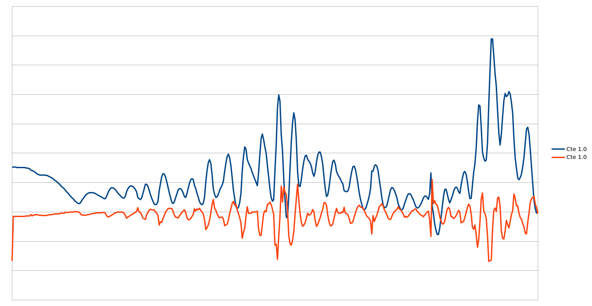
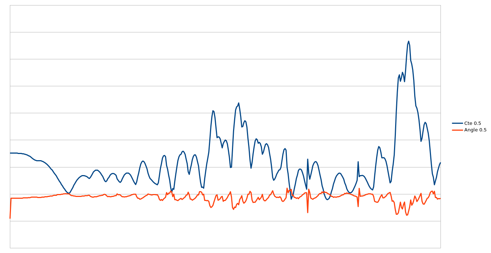
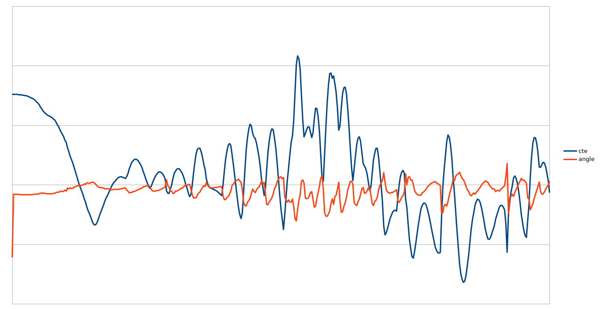

# Parameter tuning

## Implementation of PID

First step I did was to implement the PID-controller (PID.h / PID.cpp) which is straight forward
and I expected it to work out of the box. The Only changes I did in contrast to the given class
was to:
* make some of the members private
* merge constructor and `init`-function to avoid using an uninitialized object
* merge `UpdateError`- and `TotalError`-function into one `step`-function as they should anyway be used in combination

I won't go into details on this here.

## Find a appropriate D-parameter

After the code of the PID-controller was set up, I started by using it as a pure P-controller (I- and D-component
disabled with factor *0.0*).
Initially I chose a value of *1.0* which oversteered way to much so, i lowered it step by step. The picture compares
multiple setting (*0.5*, *0.1*, *0.05*):

While *0.5* still creates a very "wobbly" driving experience, driving gets more and more smooth when you lower the value.
*0.05* tends to work great on the beginning of the track, driving is very smooth, but it is unable to get around curves, so
i stuck with a value of *0.1* for the D-parameter for further experiments. Still, the pure P-controller is not able to make
it around sharp curves.

## Helping the car around curves

A D-controller is obviously not able to make it around sharp curves. To help in those places the D-parameter is great as
it reacts on deviations quickly. The problem is that a too high value makes the car move nervous, so the chosen value should
just be big enough to give a "kick" around a corner while the straight driving should still be dominated by the D-parameter.

I started with a value of *0.1* and increased step by step. The following pictures show that even a slight increase from
*0.5* to *1.0* changes the behavior a lot. The controller's output is much more "noisy" with a value of *1.0*.

<pic><pic>

I finally decided to use a value in between (*0.7*) which is still able to run the course but the car is less nervous.

## Removing the bias

Using the chosen parameters, the car tends to stay on one side of the road (can be seen by the steering-angle, which is
almost always "above the center-line" of the images) and is in general very nervous. This can be reduced by adding some
"long-time-smoothing" using the I-parameter. The value usually needs to be very small, otherwise it could (in worst case)
drift away the controller slowly. I initially chose *0.001* which instantly gave a good result. After adding it, the output
of the controller looks much more "centric":

